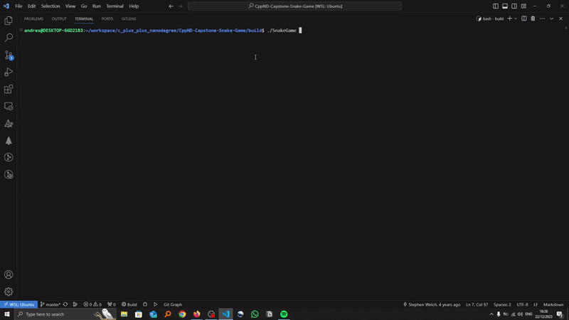

# CPPND: Capstone Snake Game Example

This is a starter repo for the Capstone project in the [Udacity C++ Nanodegree Program](https://www.udacity.com/course/c-plus-plus-nanodegree--nd213). The code for this repo was inspired by [this](https://codereview.stackexchange.com/questions/212296/snake-game-in-c-with-sdl) excellent StackOverflow post and set of responses.



The Capstone Project gives you a chance to integrate what you've learned throughout this program. This project will become an important part of your portfolio to share with current and future colleagues and employers.

In this project, you can build your own C++ application or extend this Snake game, following the principles you have learned throughout this Nanodegree Program. This project will demonstrate that you can independently create applications using a wide range of C++ features.

## Dependencies for Running Locally
* cmake >= 3.7
  * All OSes: [click here for installation instructions](https://cmake.org/install/)
* make >= 4.1 (Linux, Mac), 3.81 (Windows)
  * Linux: make is installed by default on most Linux distros
  * Mac: [install Xcode command line tools to get make](https://developer.apple.com/xcode/features/)
  * Windows: [Click here for installation instructions](http://gnuwin32.sourceforge.net/packages/make.htm)
* SDL2 >= 2.0
  * All installation instructions can be found [here](https://wiki.libsdl.org/Installation)
  >Note that for Linux, an `apt` or `apt-get` installation is preferred to building from source. 
* gcc/g++ >= 5.4
  * Linux: gcc / g++ is installed by default on most Linux distros
  * Mac: same deal as make - [install Xcode command line tools](https://developer.apple.com/xcode/features/)
  * Windows: recommend using [MinGW](http://www.mingw.org/)

## Basic Build Instructions

1. Clone this repo.
2. Make a build directory in the top level directory: `mkdir build && cd build`
3. Compile: `cmake .. && make`
4. Run it: `./SnakeGame`.

## New Feature added to the Game
1. The Player can insert a name. 
2. There are two types of food in the game, red ones score 3 points, while yellow ones only 1.
3. Once the food is consumed by the snake, any of the two types of foods can appear in the game.
4. Two Additional Keys were added, 'Q' makes the snake decrease its velocity, while 'R' makes the snake increase its velocity. WATCH OUT!! You can go go backwards if you press too much, which makes it even funnier. 

## How to Play the game
1. Once the program is executed, then put your name in the terminal.
2. Go to the actual game and press any of the following keys:
  * **'Up' Key** = Snake moves up.
  * **'Left' Key** = Snake moves left.
  * **'Right' Key** = Snake moves right.
  * **'Down' Key** = Snake moves down.
  * **'Q' Key** = Snake reduces speed and can go backwards.
  * **'R' Key** = Snake increases speed and can go backwards.
3. Keep playing until the snake hits its head within itself. 
4. Once the game is over, The name, score, and size of the snake will be shown in the terminal.

## Rubric Criteria
In the following subsections only the criteria that are satisfied will be shown:
### Loops, Functions, I/O
1. **The project demonstrates an understanding of C++ functions and control structures.** 
- This applies to all the src scripts modified and changed from the entire project.
2. **The project accepts user input and processes the input.**
- Two files were modified to add the Q and R keys, these are located in the ```controller.cpp``` and ```controller.h```
3. **The project uses data structures and immutable variables.**
- This applies to all the src scripts modified and changed from the entire project.

### Object Oriented Programming 
1. **One or more classes are added to the project with appropriate access specifiers for class members.**
- Two additional classes were added to the game. ```Food``` and ```gameObject``` classes. Each of them have their own access specifiers, and methods to modify and get the member variables.
2. **Class constructors utilize member initialization lists.**
- The new class added ```Food``` uses initialization list for its constructor. This also applies for all the remaning classes of the project.
3. **Classes follow an appropriate inheritance hierarchy with virtual and override functions.**
- The aforementioned classes are orders in hierarchy, ```gameObject``` class is a virtual class that is parent of class ```Food```, and in this class override operator is used as well. The idea of the ```gameObject``` class was to derive other types of class such as ```Obstacles``` , but this might be added in the future.

### Memory Management
1. **The project makes use of references in function declarations.**
- This applies for almost any script in the current submission, but one example is ```food.h```, in the ```FoodQuality randomlyChangeQuality(std::uniform_int_distribution<int> &random_f, std::mt19937 &engine)``` we passed to two parameters by reference.
2. **The project uses move semantics to move data instead of copying it, where possible.**
- Move semantics is used in the ```main.cpp```, the following code ```Game game(kGridWidth, kGridHeight, std::move(food));``` passes the created object ```Food``` to the ```Game``` class.
3. **The project uses smart pointers instead of raw pointers.**
- The code uses only ```unique_pointer```, which is located in the ```main.cpp``` and this is the line of code ```auto food = std::make_unique<Food>();```. This is used to transfer the ownership of the class ```Food``` to class ```Game```.

### Concurrency
1. **The project uses multithreading.**
- Only a child thread was created in the ```main.cpp```, the line of code is ```std::thread producer(&Game::GetEndGameInformation, &game, std::move(myPromise));```. This thread returns the final score when the player lost the game.

2. **A promise and future is used in the project.**
- This criteria is also satisfied in the ```main.cpp```, to be more precise in the following line ```  std::promise<Game::gameInformation> myPromise;```, ```std::future<Game::gameInformation> myFuture = myPromise.get_future();```, and line shown in the previous criteria. With this we can receive data from the method to the main program.

## CC Attribution-ShareAlike 4.0 International


Shield: [![CC BY-SA 4.0][cc-by-sa-shield]][cc-by-sa]

This work is licensed under a
[Creative Commons Attribution-ShareAlike 4.0 International License][cc-by-sa].

[![CC BY-SA 4.0][cc-by-sa-image]][cc-by-sa]

[cc-by-sa]: http://creativecommons.org/licenses/by-sa/4.0/
[cc-by-sa-image]: https://licensebuttons.net/l/by-sa/4.0/88x31.png
[cc-by-sa-shield]: https://img.shields.io/badge/License-CC%20BY--SA%204.0-lightgrey.svg
